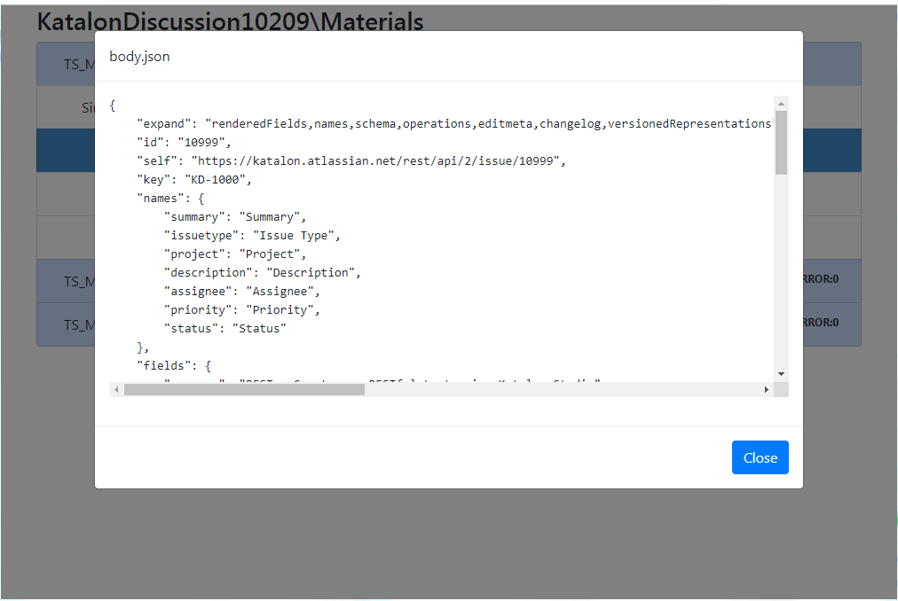
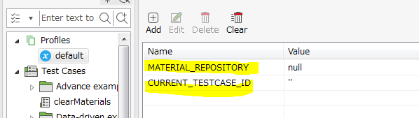

Logging Response Headers and Bodies of Web Service --- Materials applied
========

## What is this?

This is a [Katalon Studio](https://www.katalon.com/) project for demonstration purpose.
You can clone it out to your PC and run with your Katalon Studio.

This project was developed using Katalon Studio version 5.8.0.

This project was developed to propose a solution to a discussion in Katalon Forum:
[*How to store response in a file*](https://forum.katalon.com/discussion/10209/how-to-store-response-in-a-file).

## Problem to solve

1. I want to test a Web Service API, like [katalon-studio-samples/jira-api-tests](https://github.com/katalon-studio-samples/jira-api-tests)
2. I want to save HTTP Response Header and Response Body into files in JSON format.
3. I want to retain files chronologically for logging purpose. I do not like overwriting files. If I execute a single Test Suite 3 times, then I want to retain 3 sets of json files.
4. I will look back retained sets of json files frequently. So I want a nice GUI that enables me to retrieve stored files quickly.

## Solution

I would introduce [Materials](https://github.com/kazurayam/Materials), a java/groovy library that resolves output file paths in a well-structured format. The  `com.kazurayam.materials.MaterialRepository` class provides convenient methods with which I can solve the above-mensioned problems easily.

1. `resolveMaterialPath(String testCaseId, String fileName)` method returns `java.nio.file.Path` object for a File to be created. The path would be in the format of
```
${projectDir}/Materials/${testSuiteName}/${testSuiteTimestamp}/${testCaseName}/${subdirs}/${fileName}
```
2. `makeIndex()` method generates the `./Materials/index.html` file. This is a simple viewer for the `Materials` folder contents.

## How to run the demo

1. download the zip of this project from [releases](https://github.com/katalon-studio-samples/jira-api-tests) page.
2. unzip it. You will obtain a folder named `KatalonDiscussion10209`.
3. start your Katalon studio, and open the project
4. open a Test Suite named `Test Suites/TS_Materials_applied` and run it.
5. you should run it multiple times. e.g., try 3 times.

## What the test does

This project is based on the [katalon-studio-samples/jira-api-tests](https://github.com/katalon-studio-samples/jira-api-tests) project.

The `Test Suites/TS_Materials_applied` executes [`Test Cases/Simple examples/api-2-issue/Get issue/Get an issue by Key - 1 - Materialized`](/Scripts/Simple%20examples/api-2-issue/Get%20issue/Get%20an%20issue%20by%20Key%20-%201%20-%20Materialized/Script1539828822545.groovy). The test case code looks like this:

```
// Send the request and get the response
response = WS.sendRequest(findTestObject('Simple examples/api-2-issue/Get issue/Get an issue by Key'))

// Verify the response
WS.verifyResponseStatusCode(response, 200)
// make MaterialRepository accessible
MaterialRepository mr = (MaterialRepository)GlobalVariable.MATERIAL_REPOSITORY

// store HTTP status
Path path1 = mr.resolveMaterialPath(GlobalVariable.CURRENT_TESTCASE_ID, "status.txt")
int status = response.getStatusCode()
path1.toFile().append("${status}", 'utf-8')

// store the HTTP Response Headers into file
Path path2 = mr.resolveMaterialPath(GlobalVariable.CURRENT_TESTCASE_ID, "headers.json")
Map<String, List<String>> headerFields = response.getHeaderFields()
String headersJson = CustomKeywords.'com.kazurayam.ksbackyard.WebServiceTestSupport.convertHeaderFieldsToJsonString'(headerFields)
path2.toFile().append(headersJson, 'utf-8')

// store the HTTP Response Body into file
Path path3 = mr.resolveMaterialPath(GlobalVariable.CURRENT_TESTCASE_ID, "body.json")
String body = response.getResponseBodyContent()
path3.toFile().append(body, 'utf-8')
```

This test case send a HTTP GET request to a RESTFul URL  https://katalon.atlassian.net/rest/api/2/issue/KD-1000?expand=names&fields=summary,status,issuetype,assignee,project,priority,description&= . The test case makes a bit of assertions over the response. And it writes the HTTP Response Headers and Body into files on local disk in JSON format.

## output

By running `Test Suites/TS_Materials_applied`, a new folder `<projectDir>/Materials` will be created. In there you can find a folder tree and a HTML file named `index.html`.


You can browse the index.html. It will look like this:


In the index you will find as many records of test suite runs as you executed. In the above screenshot, you can find 3 times of test suite run recorded.

Each test suite run contains a record of test case run, which contains links to the files created.

By clicking the links, you can view the files in modal widdow. Here is `headers.json`:


Here is `body.json`:



## Path format

The created files has a path like this:
```
${projectDir}/Materials/${testSuiteName}/${testSuiteTimestamp}/${testCaseName}/${subdirs}/${fileName}
```

A concrete path example:

```
./Materials/TS_Materials_applied/20181018_140249/Simple examples.api-2-issue.Get issue.Get an issue by Key - 1 - Materialized/header.json
```

Please note that this folder tree contains a timestamp layer `yyyyMMdd_hhmmss`. *Having a timestamp layer enables you to retain outputs as long as you like until you intensionally delete them. This chronological folder structure is best fit for logging purpose.*


## How to reproduce a Materials-enabled project for your self

Here I would describe, step by step, for you how to recreate a Katalon Studio project which has the Materials library builting and enabled.

1. create a new katalon project, or clone some existing project. For example, clone the [katalon-studio-samples/jira-api-tests](https://github.com/katalon-studio-samples/jira-api-tests) project.
2. import Materials-0.22.0.jar or heigher into your katalon project. Refer to the Katalon documentation ['Import Java library'](https://docs.katalon.com/katalon-studio/tutorials/import_java_library.html) for operation instruction. You can download jar from [release](https://github.com/kazurayam/Materials/releases) page. Or you can reuse the [jar already imported into this project](Drivers/). 
3. Edit Profiles > default in your project. Add `MATERIALS_REPOSITORY` with type Null. Add `CURRENT_TESTCASE_ID` with type String. 
4. Create a Test Listener in your project, and copy & paste the source of [Tests](Test%20Listeners/Tests.groovy). You need not change it at all. If you have your own test listener, then carefully edit it so that your test listener works similar to the `Tests`.
5. Add a test case named `Test Cases/cleanMaterials` in your project. Copy and paste the source of [`Test Cases/clearMaterials`](Scripts/clearMaterials/Script1539827008519.groovy). You need not to change the code at all.
6. Add a test case name `Test Cases/makeIndex` in your project. Copy and paste the source of [`Test Cases/makeIndex`](Scripts/makeIndex/Script1539827017814.groovy). You need not to change the code at all.
7. Now you add your own test case which actually test your target Web Services. Refer to [Test Cases/Simple examples/api-2-issue/Get issue/Get an issue by Key - 1 - Materialized](Scripts/Simple%20examples/api-2-issue/Get%20issue/Get%20an issue%20by%20Key%20-%201%20-%20Materialized/Script1539828822545.groovy) as an example.
8. Add a test suite which calls 3 test cases --- `cleanMaterials`, *your own test case* and `makeIndex`.  . The test suite can have any name you like.
9. In the definiton of test suite, there is a row labeled `Run`. In the Run row, there are toggle controls. You can choose each test cases to run or not. If you toggle on the `cleanMaterials` test case, then the `./Materials` directory will be cleaned every time when the test suite runs. If you toggle off, then you can see multiple records of test sute runs accumulated in the index.html viewer.
